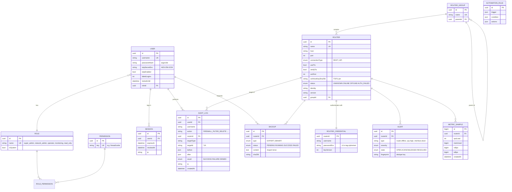

# ERD دیتابیس

منبع حقیقت: [`apps/api/prisma/schema.prisma`](../apps/api/prisma/schema.prisma) — مایگریشن اولیه در `apps/api/prisma/migrations/`.

## تصمیم‌های طراحی

| تصمیم | چرا |
|---|---|
| `router_credentials` جدول جدا | رمز هیچ‌وقت همراه یک `SELECT` معمولی روی `routers` بیرون نمی‌آید. سرویس‌ها فقط `username` را انتخاب می‌کنند. |
| رمز با AAD = `router:<id>` رمزنگاری می‌شود | کپی کردن ciphertext یک روتر روی روتر دیگر باعث شکست رمزگشایی می‌شود. |
| `keyVersion` | چرخش کلید بدون downtime (جزئیات در [security.md](security.md)). |
| جدول `sessions` در کنار JWT | JWT امضا را تضمین می‌کند، ردیف session امکان باطل‌کردن فوری (logout، قفل، تغییر نقش) را می‌دهد. |
| `audit_logs.username` denormalized | لاگ حتی بعد از حذف کاربر معنادار می‌ماند (`userId` → `SET NULL`). |
| `alerts.fingerprint` | جلوگیری از هشدار تکراری: فقط یک هشدار باز برای هر (روتر، نوع، موضوع). |
| `metric_samples` با retention کوتاه | فقط برای نمودارهای داشبورد (پیش‌فرض ۲۴ ساعت). تاریخچه‌ی بلندمدت در Prometheus. |
| جداول firewall/nat/route **ذخیره نمی‌شوند** | منبع حقیقت پیکربندی خود روتر است؛ کپی در DB فوراً کهنه می‌شود. تاریخچه‌ی پیکربندی با backup/diff و تاریخچه‌ی تغییرات با audit log پوشش داده می‌شود. |
